# School Management System — Class Diagram

> OOP Model: Models, Helpers, Config classes and their relationships

```mermaid
classDiagram

    %% ── Config / Infrastructure ───────────────────────────────────────────
    class Database {
        -static PDO $instance
        +static connect() PDO
    }

    class Setting {
        -static array $cache
        +static get(key, default) string
        +static set(key, value) bool
        +static clearCache() void
    }

    %% ── Helpers ───────────────────────────────────────────────────────────
    class Auth {
        +static check() bool
        +static role() string
        +static userId() int
        +static profileId() int
        +static requireRole(roles) void
    }

    class Utility {
        +static generateCSRFToken() string
        +static validateCSRFToken(token) bool
        +static setFlash(type, message) void
        +static renderFlash() void
        +static uploadImage(file, dest) array
    }

    class Validation {
        -array errors
        +required(fields, data) self
        +email(field, value) self
        +minLength(field, value, min) self
        +maxLength(field, value, max) self
        +passes() bool
        +getErrors() array
    }

    class ExportHelper {
        +static toCSV(filename, headers, data) void
        +static renderPrintLayout(title, headers, data) void
    }

    %% ── Domain Models ─────────────────────────────────────────────────────
    class User {
        +static getAll(filters) array
        +static getById(id) array
        +static findByUsername(username) array
        +static create(data) bool
        +static update(id, data) bool
        +static delete(id) bool
        +static updatePassword(id, hash) bool
        +static toggleStatus(id) bool
        +static verifyPassword(plain, hash) bool
    }

    class Student {
        +static getAll(filters) array
        +static getById(id) array
        +static create(data) int|false
        +static update(id, data) bool
        +static delete(id) bool
        +static countAll() int
    }

    class Teacher {
        +static getAll(filters) array
        +static getById(id) array
        +static create(data) int|false
        +static update(id, data) bool
        +static delete(id) bool
        +static getByUserId(userId) array
    }

    class SchoolClass {
        +static getAll() array
        +static getById(id) array
        +static create(name, section, year) bool
        +static update(id, name, section, year) bool
        +static delete(id) bool
    }

    class Subject {
        +static getAll(filters) array
        +static getById(id) array
        +static create(data) bool
        +static update(id, data) bool
        +static delete(id) bool
        +static getByClass(classId) array
    }

    class Timetable {
        +static getByClass(classId) array
        +static getByTeacher(teacherId) array
        +static create(data) bool
        +static delete(id) bool
    }

    class Attendance {
        +static markBulk(records, date) bool
        +static getByClass(classId, date) array
        +static getMonthlyReport(classId, month) array
        +static getStudentLog(studentId) array
        +static markTeacherBulk(records, date) bool
        +static getTeacherReport(teacherId, month) array
    }

    class Exam {
        +static getAll() array
        +static getById(id) array
        +static create(name, classId, date, year) bool
        +static delete(id) bool
        +static getSubjectMarks(examId, subjectId) array
        +static saveSubjectMarks(examId, subjectId, marks) bool
        +static getStudentReport(studentId, examId) array
        +static calculateGrade(percentage) array
    }

    class Fee {
        +static getAll(filters) array
        +static getById(id) array
        +static create(studentId, type, amount, due, year) bool
        +static generateBulk(classId, type, amount, due, year) int
        +static delete(id) bool
        +static recordPayment(feeId, amount, method, ref) string|false
        +static getPayments(feeId) array
        +static getByReceipt(receiptNo) array
        +static getSummary(year) array
        +static getForStudent(studentId) array
        -static updateStatus(feeId, db) void
    }

    class Book {
        +FINE_PER_DAY$ float
        +static getAll(search) array
        +static getById(id) array
        +static create(data) bool
        +static update(id, data) bool
        +static delete(id) bool
        +static getBorrowedCount(bookId) int
        +static issueBook(bookId, studentId, days) int|false
        +static returnBook(borrowId) array|false
        +static markFinePaid(borrowId) bool
        +static getAllBorrows(filters) array
        +static refreshOverdueStatuses() void
        +static getStats() array
    }

    %% ── Relationships ─────────────────────────────────────────────────────
    Database <.. Setting : uses
    Database <.. Auth : uses
    Database <.. User : uses
    Database <.. Student : uses
    Database <.. Teacher : uses
    Database <.. SchoolClass : uses
    Database <.. Subject : uses
    Database <.. Timetable : uses
    Database <.. Attendance : uses
    Database <.. Exam : uses
    Database <.. Fee : uses
    Database <.. Book : uses

    Auth ..> User : authenticates via
    Auth ..> Student : resolves profile
    Auth ..> Teacher : resolves profile

    Student --> User : extends (1 user_id)
    Teacher --> User : extends (1 user_id)

    Subject --> SchoolClass : belongs to
    Subject --> Teacher : taught by
    Timetable --> SchoolClass : schedules
    Timetable --> Subject : assigns

    Attendance --> Student : records for
    Attendance --> Teacher : records for

    Exam --> SchoolClass : held for
    Exam --> Subject : covers
    Exam --> Student : grades

    Fee --> Student : billed to
    Book --> Student : borrowed by

    Utility <.. ExportHelper : uses Setting
    ExportHelper ..> Setting : reads school_name
```

## Class Responsibility Summary

| Class | Layer | Responsibility |
|---|---|---|
| `Database` | Infrastructure | Singleton PDO connection factory |
| `Setting` | Infrastructure | Key-value config store with in-memory cache |
| `Auth` | Helper | Session-based role access control |
| `Utility` | Helper | CSRF, flash messages, file uploads |
| `Validation` | Helper | Form input validation chain |
| `ExportHelper` | Helper | CSV export, print-layout HTML generation |
| `User` | Model | Authentication credentials management |
| `Student` | Model | Student records linked to User |
| `Teacher` | Model | Teacher records linked to User |
| `SchoolClass` | Model | Academic class/section management |
| `Subject` | Model | Subject-to-class-and-teacher mapping |
| `Timetable` | Model | Weekly schedule slot assignment |
| `Attendance` | Model | Daily presence recording and aggregation |
| `Exam` | Model | Exam scheduling, mark recording, grade calculation |
| `Fee` | Model | Invoice generation, payment recording, receipts |
| `Book` | Model | Library inventory, borrow/return, fine calculation |
