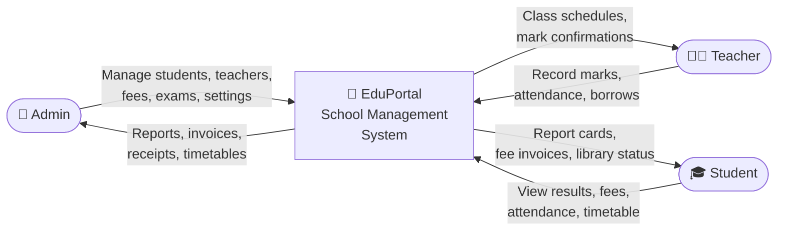
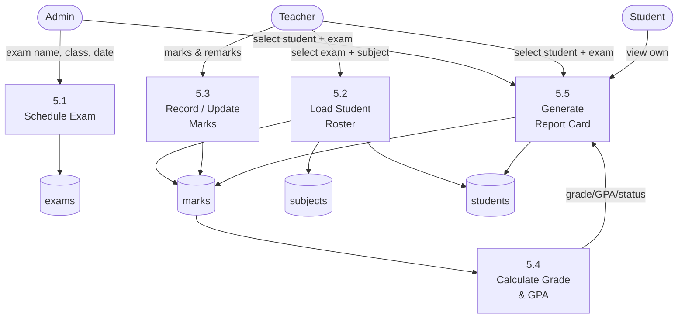
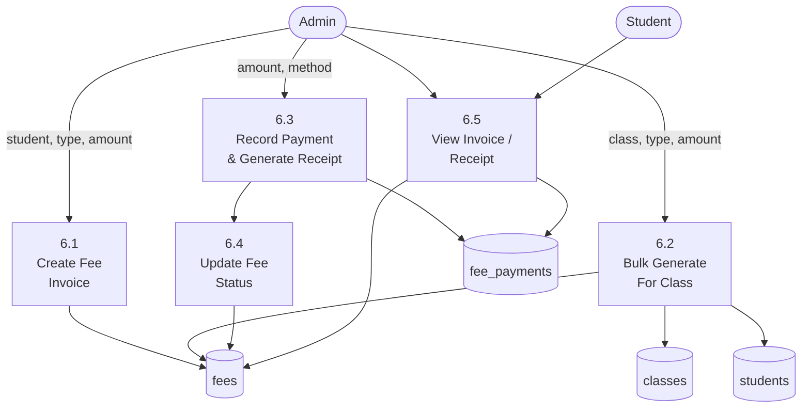

# School Management System — Data Flow Diagram (DFD)

## Level 0 — Context Diagram

---

## Level 1 — Main Process Decomposition

```mermaid
flowchart TD
    %% External Entities
    ADMIN(["Admin"])
    TEACHER(["Teacher"])
    STUDENT(["Student"])

    %% Level-1 Processes
    P1["1.0\nAuthentication\n& Sessions"]
    P2["2.0\nStudent & Teacher\nManagement"]
    P3["3.0\nAcademic Scheduling\n(Timetable + Subjects)"]
    P4["4.0\nAttendance\nTracking"]
    P5["5.0\nExam & Marks\nManagement"]
    P6["6.0\nFee & Payment\nProcessing"]
    P7["7.0\nLibrary\nManagement"]
    P8["8.0\nReports &\nAnalytics"]
    P9["9.0\nSettings &\nConfiguration"]

    %% Data Stores
    DS1[("DB: users")]
    DS2[("DB: students\nteachers")]
    DS3[("DB: classes\nsubjects\ntimetables")]
    DS4[("DB: student_attendance\nteacher_attendance")]
    DS5[("DB: exams\nmarks")]
    DS6[("DB: fees\nfee_payments")]
    DS7[("DB: books\nbook_borrows")]
    DS8[("DB: settings\nannouncements")]

    %% Authentication flows
    ADMIN -- credentials --> P1
    TEACHER -- credentials --> P1
    STUDENT -- credentials --> P1
    P1 <--> DS1

    %% Admin drives management
    ADMIN -- student/teacher data --> P2
    P2 <--> DS2

    %% Admin configures schedules
    ADMIN -- class/subject/timetable data --> P3
    P3 <--> DS3

    %% Attendance marking
    ADMIN & TEACHER -- attendance records --> P4
    P4 <--> DS4
    STUDENT -- views own --> P4

    %% Exams and marks
    ADMIN -- exam schedules --> P5
    TEACHER -- mark scores --> P5
    P5 <--> DS5
    STUDENT -- views report card --> P5

    %% Fees
    ADMIN -- invoice / payment --> P6
    P6 <--> DS6
    STUDENT -- views own fees --> P6

    %% Library
    ADMIN & TEACHER -- book issue/return --> P7
    P7 <--> DS7
    STUDENT -- views borrows --> P7

    %% Reports
    ADMIN -- filter params --> P8
    P8 --> DS2
    P8 --> DS4
    P8 --> DS5
    P8 --> DS6

    %% Settings
    ADMIN -- settings updates --> P9
    P9 <--> DS8
```

---

## Level 2 — Process 5.0: Exam & Marks Management

---

## Level 2 — Process 6.0: Fee & Payment Processing

