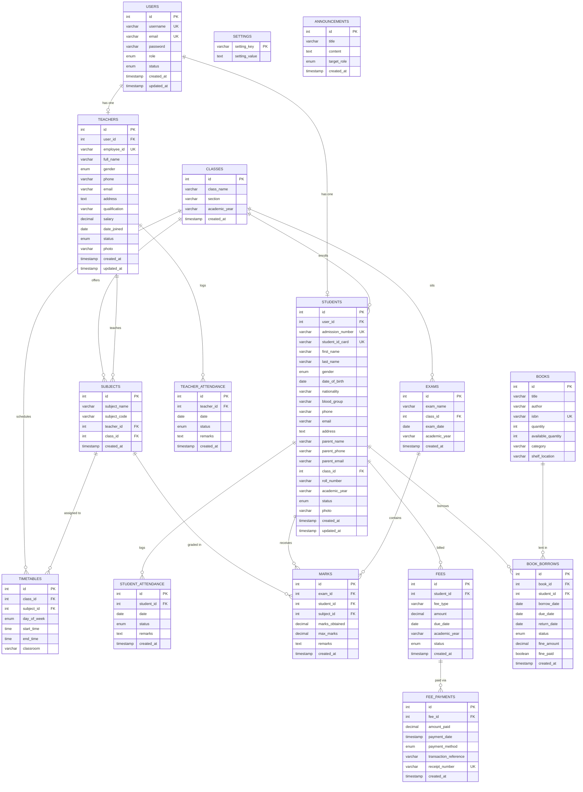

# School Management System — Entity Relationship Diagram

> Generated: 2026-07-08 | Database: `school_management` | Tables: 16

## Key Relationships Summary

| Relationship | Type | Notes |
|---|---|---|
| Users → Students | One-to-One | CASCADE delete |
| Users → Teachers | One-to-One | CASCADE delete |
| Classes → Students | One-to-Many | SET NULL on class delete |
| Classes → Subjects | One-to-Many | CASCADE delete |
| Classes → Exams | One-to-Many | CASCADE delete |
| Teachers → Subjects | One-to-Many | SET NULL on teacher delete |
| Subjects → Marks | One-to-Many | CASCADE delete |
| Students → Marks | One-to-Many | CASCADE delete |
| Exams → Marks | One-to-Many | CASCADE delete |
| Fees → FeePayments | One-to-Many | CASCADE delete |
| Books → BookBorrows | One-to-Many | CASCADE delete |

## Unique Constraints

| Table | Unique Key |
|---|---|
| users | username, email |
| students | admission_number, student_id_card |
| teachers | employee_id |
| classes | (class_name, section, academic_year) |
| subjects | (subject_code, class_id) |
| student_attendance | (student_id, date) |
| teacher_attendance | (teacher_id, date) |
| marks | (exam_id, student_id, subject_id) |
| fee_payments | receipt_number |
| books | isbn |
