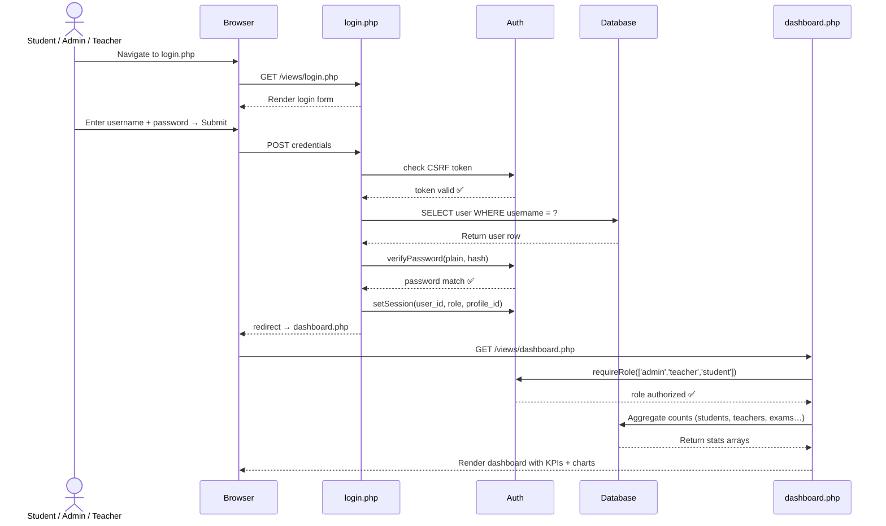
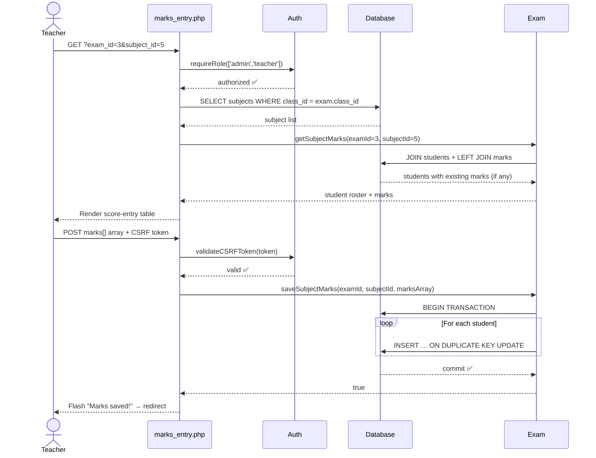
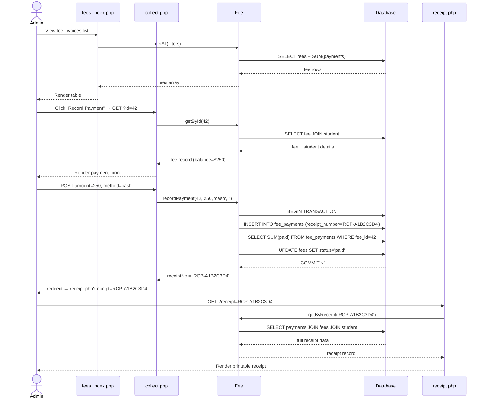
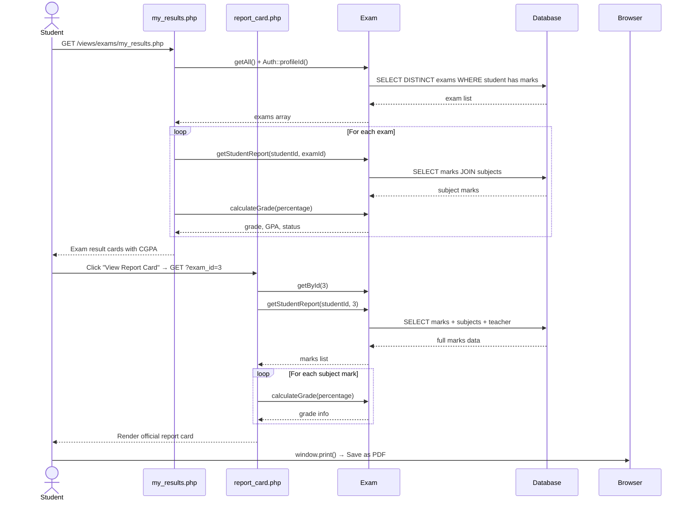
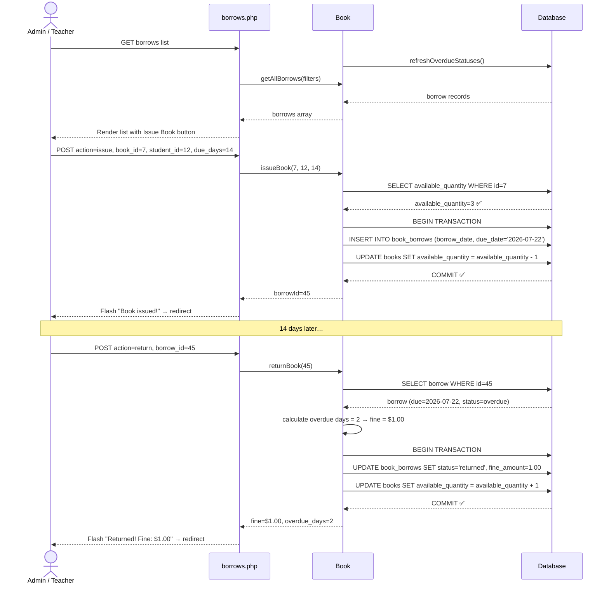

# School Management System — Sequence Diagrams

## Sequence 1: Student Login & Dashboard Load

---

## Sequence 2: Teacher Records Student Marks

---

## Sequence 3: Admin Collects Fee Payment & Issues Receipt

---

## Sequence 4: Student Views Report Card

---

## Sequence 5: Librarian Issues & Returns Book

