# School Management System — Use Case Diagram

> Actors: **Admin**, **Teacher**, **Student** | System: EduPortal

```mermaid
graph TB
    subgraph Actors
        A((Admin))
        T((Teacher))
        S((Student))
    end

    subgraph UC["Use Cases — EduPortal"]
        direction TB

        subgraph AUTH["Authentication"]
            UC1[Login to System]
            UC2[Logout]
            UC3[Update Profile & Password]
            UC4[Upload Avatar Photo]
        end

        subgraph DASH["Dashboard"]
            UC5[View Dashboard Summary]
            UC6[View Announcements]
        end

        subgraph ADMIN_ONLY["Admin-Only Management"]
            UC7[Manage Students CRUD]
            UC8[Manage Teachers CRUD]
            UC9[Manage Classes & Sections]
            UC10[Manage Subjects]
            UC11[Manage User Accounts]
            UC12[Configure Timetable]
            UC13[Schedule Exams]
            UC14[Generate Fee Invoices]
            UC15[Generate Bulk Fee Invoices]
            UC16[Record Fee Payments]
            UC17[Print Receipts & Invoices]
            UC18[Manage Library Catalog]
            UC19[View Analytics & Reports]
            UC20[Configure System Settings]
            UC21[Upload School Logo]
            UC22[Create Announcements]
            UC23[Mark Teacher Attendance]
        end

        subgraph TEACHER_ADMIN["Teacher + Admin"]
            UC24[Record Student Marks]
            UC25[Mark Student Attendance]
            UC26[Issue Books to Students]
            UC27[Process Book Returns]
            UC28[Mark Fine as Paid]
            UC29[View Report Cards]
        end

        subgraph STUDENT_ONLY["Student Portal"]
            UC30[View Personal Timetable]
            UC31[View Own Attendance Log]
            UC32[View Exam Results]
            UC33[View GPA Report Card]
            UC34[View Fee Invoices]
            UC35[View Payment Receipts]
            UC36[View Borrowed Books]
            UC37[Browse Library Catalog]
        end
    end

    %% Admin use cases
    A --> UC1
    A --> UC2
    A --> UC3
    A --> UC5
    A --> UC6
    A --> UC7
    A --> UC8
    A --> UC9
    A --> UC10
    A --> UC11
    A --> UC12
    A --> UC13
    A --> UC14
    A --> UC15
    A --> UC16
    A --> UC17
    A --> UC18
    A --> UC19
    A --> UC20
    A --> UC21
    A --> UC22
    A --> UC23
    A --> UC24
    A --> UC25
    A --> UC26
    A --> UC27
    A --> UC28
    A --> UC29

    %% Teacher use cases
    T --> UC1
    T --> UC2
    T --> UC3
    T --> UC5
    T --> UC6
    T --> UC24
    T --> UC25
    T --> UC26
    T --> UC27
    T --> UC28
    T --> UC29
    T --> UC30
    T --> UC37

    %% Student use cases
    S --> UC1
    S --> UC2
    S --> UC3
    S --> UC5
    S --> UC6
    S --> UC30
    S --> UC31
    S --> UC32
    S --> UC33
    S --> UC34
    S --> UC35
    S --> UC36
    S --> UC37
```

## Actor Permissions Matrix

| Feature | Admin | Teacher | Student |
|---|:---:|:---:|:---:|
| Login / Logout | ✅ | ✅ | ✅ |
| Update Own Profile | ✅ | ✅ | ✅ |
| View Dashboard | ✅ | ✅ | ✅ |
| Manage Students (CRUD) | ✅ | — | — |
| Manage Teachers (CRUD) | ✅ | — | — |
| Manage Classes & Subjects | ✅ | — | — |
| Manage User Accounts | ✅ | — | — |
| Configure Timetable | ✅ | — | — |
| View Timetable | ✅ | ✅ | ✅ |
| Mark Student Attendance | ✅ | ✅ | — |
| Mark Teacher Attendance | ✅ | — | — |
| View Own Attendance | — | — | ✅ |
| Schedule Exams | ✅ | — | — |
| Record Exam Marks | ✅ | ✅ | — |
| View Own Results / Report Card | — | — | ✅ |
| View All Report Cards | ✅ | ✅ | — |
| Generate Fee Invoices | ✅ | — | — |
| Record Fee Payments | ✅ | — | — |
| View Own Fees | — | — | ✅ |
| Manage Library Books | ✅ | — | — |
| Issue / Return Books | ✅ | ✅ | — |
| View Own Borrowed Books | — | — | ✅ |
| Browse Library Catalog | ✅ | ✅ | ✅ |
| Create Announcements | ✅ | — | — |
| View Announcements | ✅ | ✅ | ✅ |
| Analytics & Reports | ✅ | — | — |
| System Settings | ✅ | — | — |
